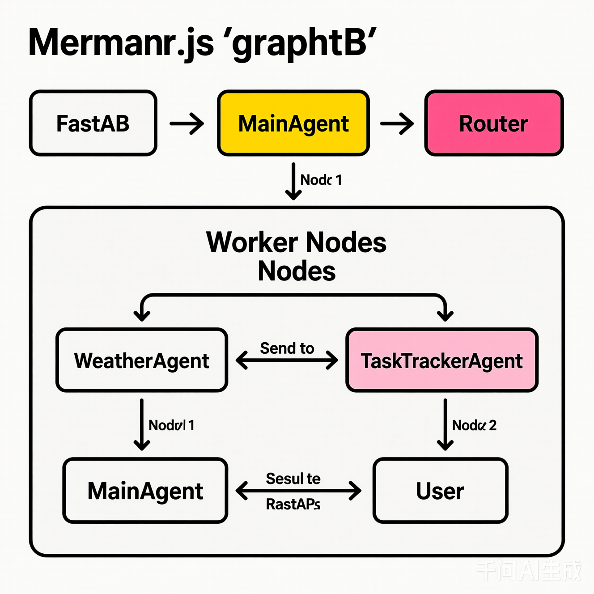

graph TB
    User[用户] -->|提交任务| API[FastAPI]
    API -->|调用| MainAgent[主Agent]
    
    MainAgent -->|广播任务| Router[Agent信息路由]
    
    subgraph WorkerNodes [Worker Nodes]
        W1[Worker Node 1]
        W2[Worker Node 2]
    end
    
    Router -->|发送任务| W1
    Router -->|发送任务| W2
    
    W1 -->|执行| WeatherAgent[天气Agent]
    W2 -->|执行| TaskTrackerAgent[任务跟踪Agent]
    
    WeatherAgent -->|返回结果| W1
    TaskTrackerAgent -->|返回结果| W2
    
    W1 -->|汇总结果| Router
    W2 -->|汇总结果| Router
    
    Router -->|返回结果| MainAgent
    MainAgent -->|返回结果| API
    API -->|返回结果| User
    
    style Router fill:#f9f,stroke:#333,stroke-width:2px
    style MainAgent fill:#ff9,stroke:#333,stroke-width:2px
